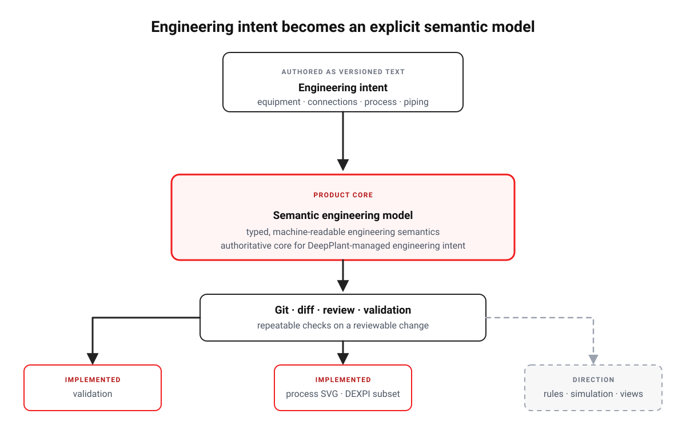

# DeepPlant

<picture>
  <source media="(prefers-color-scheme: dark)" srcset="assets/brand/logo/deepplant-horizontal-dark.svg">
  
</picture>

[](https://github.com/Semtexcz/DeepPlant/actions/workflows/ci.yml)
[](LICENSE)
[](pyproject.toml)
[](docs/dev/planning/roadmap.md)

> **Engineering as Code for process plants.**

DeepPlant is an experimental, open-source, Git-native semantic engineering
platform for process plants. It keeps DeepPlant-managed engineering intent in an
explicit, machine-readable semantic model so that intent can be versioned,
reviewed, validated, and used to derive engineering views and exchange
representations — instead of leaving meaning implicit in drawings, documents, or
tool-specific databases.

<picture>
  <source media="(prefers-color-scheme: dark)" srcset="docs/assets/readme/deepplant-overview-dark.svg">
  
</picture>

## Engineering as Code

Engineering as Code applies software-engineering practice to engineering intent.
Instead of encoding meaning only as graphics and documents, the intent is written
explicitly in a **semantic model**:

- engineering intent belongs in an explicit, machine-readable model;
- that model is plain text, so it can be versioned in Git;
- changes can be diffed and reviewed like code;
- structural and reference rules can be validated automatically;
- drawings and documents are **views** derived from the model;
- exchange formats are **adapters** around the model;
- the semantic engineering model stays the core.

This is the same idea that made software engineering reliable — version control,
review, automated checks, reproducibility — applied to the engineering
information itself rather than only to the files that display it.

## Why DeepPlant?

Process-engineering information is routinely fragmented across drawings,
documents, spreadsheets, simulators, and specialist tools. The typical
consequences are familiar:

- the same intent is duplicated across artifacts and drifts apart;
- changes are hard to review at the level of engineering meaning;
- semantics are weak or absent in machine-readable form;
- traceability between intent and its representations is limited;
- interoperability between engineering tools loses context;
- automated validation is hard to apply consistently;
- drawing-centric workflows leave engineering intent implicit.

DeepPlant is motivated by a single boundary: make the engineering semantics
explicit first, then let workflows, views, checks, and integrations build on that
shared meaning. It does not claim to replace existing engineering systems, and it
does not yet solve every problem listed above — this is the problem space and the
design motivation.

## What works today

DeepPlant currently ships a deliberately narrow, executable semantic foundation:

- **Typed semantic models** for physical plant topology, the process graph, and
  physical piping realization.
- **YAML load/save** that validates authored documents into typed models.
- **Validation** of structural and reference rules through the `deepplant` CLI.
- A **basic headless process renderer** that turns a process model into a
  standalone SVG diagram through the Python API.
- A documented **`basic` SVG symbol-pack contract**.
- A **narrow DEXPI 2.0.0 Process import/export adapter** with an explicit
  supported subset.

Exact behavior lives in the [current contracts](docs/contracts/index.md); the
implemented boundaries are mapped in the
[architecture](docs/dev/architecture/index.md), and the adapter's supported
subset and limits are in the
[DEXPI Process adapter reference](docs/dev/reference/dexpi-process-adapter.md).

## A small semantic model

The bundled [minimal process example](examples/minimal-process/plant.yaml) models
a feed tank, a feed pump, and one explicit connection between their ports:

```yaml
plant:
  id: demo
  name: Minimal Process

equipment:
  - id: T-101
    type: tank
    ports:
      - id: outlet
  - id: P-101
    type: pump
    ports:
      - id: suction

connections:
  - id: C-001
    source: {component: T-101, port: outlet}
    target: {component: P-101, port: suction}
```

The YAML is a serialization format, not the domain model itself: DeepPlant loads
it into typed semantic objects and checks that the referenced equipment and ports
actually exist. A connection here is semantic topology — not yet a pipe, stream,
or signal.

### Validate it

```bash
uv run deepplant validate examples/minimal-process/plant.yaml
```

```text
✓ valid DeepPlant model
✓ plant: demo
✓ equipment: 2
✓ ports: 3
✓ connections: 1
```

## Quick start

From a repository checkout, with `uv` and `make` installed:

```bash
make setup
uv run deepplant validate examples/minimal-process/plant.yaml
```

`make setup` runs `uv sync` to create the environment, and the second command
validates the bundled model and prints the summary shown above. For the full
first-use workflow, see [Getting Started](docs/user/getting-started.md).

## Design principles

- **Semantic model first** — the CLI, renderer, and adapters depend on the
  engineering model, never the reverse.
- **Explicit typed data** — authored YAML is validated into typed objects;
  unknown fields and unresolved references fail fast instead of being guessed.
- **Git-native changes** — identifiers are authored and stable, so text diffs
  stay small and reviewable.
- **Views stay separate from meaning** — symbols, coordinates, and layout belong
  to presentation, not to engineering semantics.
- **Interoperability through adapters** — external formats are translated around
  the canonical model rather than shaping it.

These principles are elaborated in the [Vision](VISION.md) and the
[architecture](docs/dev/architecture/index.md).

## Where DeepPlant is going

The long-term direction includes richer PFD/P&ID views, interactive engineering,
engineering rules as code, calculation and simulation integration, broader
interoperability, safety-engineering traceability, multi-discipline engineering,
an engineering IDE, and AI-assisted workflows over an explicit model.

These are **directional capabilities**, not current features and not delivery
commitments. The [Vision](VISION.md) records the thesis, the
[current roadmap](docs/dev/planning/roadmap.md) records the immediate state and
evidence gaps, and the
[directional capability roadmap](docs/dev/planning/direction.md) records the
long-term capability progression.

## Documentation

**Users**

- [Getting Started](docs/user/getting-started.md)
- [User documentation](docs/user/index.md)
- [What is DeepPlant?](docs/user/concepts/what-is-deepplant.md)

**Developers**

- [Developer documentation](docs/dev/index.md)
- [Architecture](docs/dev/architecture/index.md)
- [Current contracts](docs/contracts/index.md)
- [Architectural decisions](docs/dev/decisions/index.md)

**Direction**

- [Vision](VISION.md)
- [Roadmap](docs/dev/planning/roadmap.md)
- [Long-term direction](docs/dev/planning/direction.md)

[docs/index.md](docs/index.md) routes documentation by audience and by knowledge
authority.

## Project status

DeepPlant is **experimental** and early-stage. Its APIs and model shapes may
change, the implemented subset is intentionally narrow, and major parts of the
vision are not implemented. The repository deliberately separates current
capabilities from future direction so that the two are not confused.

## License, contributions, and project identity

DeepPlant is licensed under the GNU Affero General Public License, version 3 only
([`AGPL-3.0-only`](LICENSE)). Commercial use under AGPL is permitted subject to
its terms; AGPL is not a non-commercial licence. See
[COMMERCIAL-LICENSING.md](COMMERCIAL-LICENSING.md) for the concise policy.

Contributions are governed by [CONTRIBUTING.md](CONTRIBUTING.md) and
[CLA.md](CLA.md). Third-party provenance is indexed in
[THIRD_PARTY_NOTICES.md](THIRD_PARTY_NOTICES.md), and project identity is
addressed in [TRADEMARKS.md](TRADEMARKS.md).
